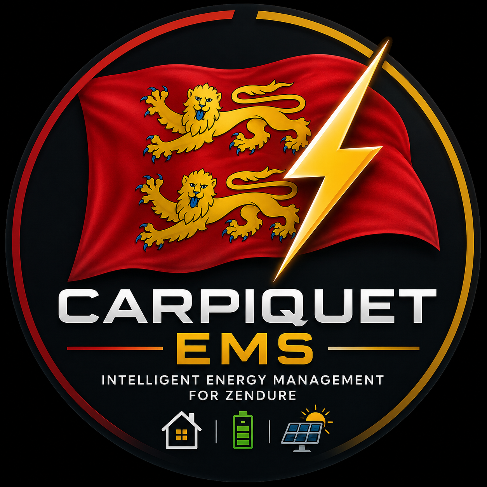

# 🏴 Carpiquet EMS

  

  <strong>Every watt counts.</strong> 
  <strong>Intelligent energy management for Zendure.</strong> 
  <em>Designed with ❤️ in Normandy.</em> 
  <strong>Engineered for reliability. Built for Home Assistant.</strong>

> **Golden Rule: Safety before performance. Always.**

Carpiquet EMS is an open-source Energy Management System for Home Assistant, initially designed for a Zendure Hyper 2000, a Zendure SolarFlow 2400 Pro and a Shelly Pro 3EM.

## Current Status

**v0.3.0-alpha — Normandy / Sprint 1**

This development package focuses on project foundations, branding, architecture and documentation.

The runtime integration remains simulation-only.

## Documentation

- [Project Charter](docs/PROJECT_CHARTER.md)
- [Roadmap](docs/ROADMAP.md)
- [Architecture](docs/ARCHITECTURE.md)
- [EMS Specification](docs/EMS_SPECIFICATION.md)
- [Algorithm](docs/ALGORITHM.md)
- [Design System](docs/DESIGN_SYSTEM.md)
- [Security](docs/SECURITY.md)
- [Installation](docs/INSTALLATION.md)
- [Configuration](docs/CONFIGURATION.md)
- [Dashboard](docs/DASHBOARD.md)
- [FAQ](docs/FAQ.md)
- [History](docs/HISTORY.md)
- [Sprint Report](docs/SPRINT_REPORT.md)

## Safety

No real Zendure command is enabled in the current alpha baseline.

## Founder

**Morgan Normand — Founder & Product Owner**
